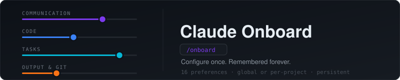

# Claude Onboard



[](https://claude.ai/code)
[](LICENSE)
[](https://github.com/JacobFitzp/claude-onboard/stargazers)

A Claude Code plugin that learns how you like to work and remembers it permanently. Run `/claude-onboard:onboard` once — every future session starts already calibrated to your preferences.

## Why

Claude's defaults are a compromise for everyone. You might want brutally honest feedback and terse responses. Your colleague might want detailed explanations and diplomatic criticism. Out of the box, Claude doesn't know which you are.

Onboarder fixes that. It asks you 16 targeted questions across 4 categories, then writes structured memory files that Claude loads automatically in every future session — no re-explaining yourself, no fighting defaults.

## Install

**From GitHub** (recommended):
```bash
/plugin marketplace add JacobFitzp/claude-onboard
/plugin install claude-onboard@JacobFitzp/claude-onboard
```

**Locally** (development / offline):
```bash
git clone https://github.com/JacobFitzp/claude-onboard
claude --plugin-dir ./claude-onboard
```

## Usage

```
/claude-onboard:onboard
```

That's it. Claude will walk you through 4 rounds of questions, then save your preferences to persistent memory. Takes about 2 minutes.

To update your preferences at any time, run `/claude-onboard:onboard` again — it overwrites the existing memory files.

## What It Configures

### Round 1 — How We Communicate
| Preference | Options |
|---|---|
| Response style | Caveman / Balanced / Detailed |
| Personality | Strictly professional / Friendly + focused / Light-hearted / Dry & sardonic |
| Bluntness | Diplomatic / Straight / Blunt / Ruthless |
| Confirmations | Minimal / Standard / Cautious |

### Round 2 — How I Write Code
| Preference | Options |
|---|---|
| Error handling | Lean (boundaries only) / Moderate / Defensive |
| Code comments | Never / Non-obvious WHY only / Liberally |
| Abstractions | Only when needed / At duplication / Proactively |
| Testing | Integration-first / Mix / Unit-first / None unless asked |

### Round 3 — How I Run Tasks
| Preference | Options |
|---|---|
| Your expertise | Junior dev / Senior engineer / Domain expert |
| Autonomy | Full autonomy / Check at decision points / Step-by-step |
| Scope discipline | Strict scope / Flag but don't fix / Fix adjacent issues |
| Proactive flags | Stay silent / Critical only / Anything notable |

### Round 4 — Output & Git
| Preference | Options |
|---|---|
| Exploration style | Direct answer / File + line refs / Summary then details |
| After task | Just stop / One-line next step / Brief summary |
| Commit style | Conventional Commits / Plain imperative / Descriptive |
| PR size | Small + focused / Bundled when sensible / No preference |

## How It Works

The first question asks whether preferences should apply to this project only or globally across all projects. Onboarder then writes 4 memory files into the appropriate directory:

- **Per-project**: `~/.claude/projects/<project>/memory/`
- **Global**: `~/.claude/memory/`

| File | Contains |
|---|---|
| `feedback_communication.md` | Response style, personality, bluntness, confirmations |
| `feedback_engineering.md` | Error handling, comments, abstractions, testing |
| `feedback_scope.md` | Expertise level, autonomy, scope, proactive flags |
| `user_profile.md` | Exploration style, after-task behavior, commits, PR size |

Claude reads these at the start of every session and applies them without being told.

## Highlights

**Bluntness dial** — choose how honest Claude is when your idea is bad. "Ruthless" means exactly that: words like "dumb" and "bad idea" used without hesitation, light code-targeted insults included.

**Expertise calibration** — tell Claude your level once. Junior devs get explanations; domain experts get maximum terseness and no hand-holding.

**Scope discipline** — one of the most common friction points with AI assistants. Onboarder lets you lock this in: strict scope only, flag-but-don't-fix, or clean up adjacent issues.

**Persistent across sessions** — preferences survive context resets, new conversations, and model updates. Run `/claude-onboard:onboard` once per project.

**Re-runnable** — preferences change. Run `/claude-onboard:onboard` any time to update. Existing memory files are overwritten, not duplicated.

## Requirements

- Claude Code
- A project with Claude Code enabled
